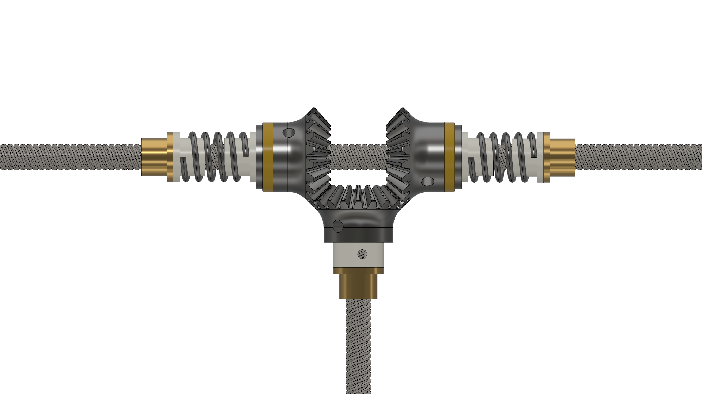

# ParaBot

## Background

`ParaBot` is an evolution of the `H-Bot/CoreXY` style of parallel, differential, Cartesian XY gantry. It is very similar to these other systems but attempts to solve several problems, both specific to `H-Bots` as well as 3D printers of this kind in general.

We'll cover the design details first, comparing to the two major current designs, and then discuss the new capabilities it provides.

## Overview

`ParaBot` uses a gantry layout where parallel linear guides are placed on top of the frame, comprising one axis, and another linear guide perpendicular to the first two, riding on their carriages. This layout is shared by `H-Bot` and `CoreXY`; `H-Bot` was named because the gantry resembles the letter `H`.

> For easy reference, we will consider the parallel guides the `Y` axis, and the moving guide the `X` axis.

The major difference is that `ParaBot` uses leadscrews to drive both `Y` and `X`, through a differential system. Kinematically, it's identical to the other systems, and firmware which supports it will also work here.

The unique aspect of this design is how the `Y` guide leadscrews are attached to the `Y` carriages, and how they transmit differential motion to the `X` carriage.

A kinematic diagram is provided: 

## Design Details

As seen in the diagram, we use two motors to drive the `Y` lead screws (which use the same handedness thread), into a gearbox assembly attached to each `Y` carriage. In this gearbox are three bevel gears:

- The `Y` gears are each attached to a screw nut which is able to rotate freely with the `Y` screw, as well as travel down the threads if held in place.
- The `X` gear is attached to the `X` lead screw, and rotates with it, in place.

When driving the `Y` screws in the same direction, they will attempt to drive the `X` gears in opposite directions, causing both gears to cog and lock. This will allow the `Y` nuts to push the gearboxes along the `Y` guides.

When driving the `Y` screws in opposite directions, they will attempt to move each `Y` gear/nut pair in opposite directions along `Y`, causing `Y` motion to lock. But they are still free to rotate in place, driving the `X` gears in the same direction, which will push the `X` carriage along the `X` guide.

A detailed view of a proposed gearbox design is provided: 

> Care was taken to ensure that both the nuts and gears are preloaded against backlash, as well as providing low-friction mating surfaces and bosses, for pieces that have to rotate against each other. Clamping and insertion points are provided for pieces that have to rotate together. The following section discusses backlash in detail.

Lastly, the lead screws' `lead` specification dictates how far a driven nut will travel per revolution. It does not apply when the nut is spinning with the screw, but in this design, when the `Y` nuts spin in place, the equal-sized gears transmit the rotation to the `X` screw, which drives the `X` carriage via its own nut. Therefore both axes are driven at the same mm/revolution rate that the screw `lead` dictates.

## Backlash

A major consideration when using screws, nuts, or gears is backlash. Backlash is when mating surfaces that transfer motion in one direction have some 'play' when the direction is reversed, before the mating surfaces engage again the other way. This leads to a loss of synchronization between the input and output, and accuracy suffers.

The proposed gearbox makes use of dual screw nuts preloaded with springs. The nuts in the picture can rotate freely, which allows their springs to keep them pushed against the screw threads in each direction. Therefore, either direction the screw spins, the backlash is taken up.

Similarly, the bevel gear teeth can be meshed fully, or separated to some degree. If they are fully meshed and fit precisely, backlash is taken up. The same spring preloading the screw nuts also preloads the `Y` gears by pushing them into the `X` gears.

With any preloading/anti-backlash system, wear is a concern. With proper lubrication on the nuts and gears, and with the proper spring strength, wear should be minimal since the gantry load is relatively small compared to the strength of the materials.

## Comparison to H-Bot

The traditional `H-Bot` gantry uses the same layout and two motors, and operates with the same differential kinematics. The motors are connected via a long continuous belt path around idlers to change the direction, ultimately connecting to either side of the `X` carriage.

When the `X` carriage is moved, the sharp right angles on the idlers of the `Y` carriages cause a twisting force (torque) on the `X` guide, which can cause it to go out of alignment if the guides/carriages aren't stiff or long enough to absorb the forces.

An diagram of the issue is provided (from [Gianluca Pugliese/FabAcademy](http://fabacademy.org/archives/2015/eu/students/pugliese.gianluca/project02.html)): 

## Comparison to CoreXY

`CoreXY` is an evolution of the basic `H-Bot`, as a method of solving the torque issue. It has equal and opposite attachment points to the `X` carriage by using two long belts and idlers instead of just one. It is essentially two `H-Bot` systems on top of each other, to balance the forces.

## ParaBot Solution

`ParaBot` attempts to solve the twisting problem because of the unique method of differentially driving lead screw nuts and the gear arrangement. It takes less torque for turning the nut with the screw (in place) than driving the nut down the screw (locking the rotation). This difference becomes greater the longer the screw lead is.

In addition, the two `Y` gears exert their differential forces oppositely, balancing the twisting force on the `X` guide. This balance of forces in differential drive is what the `ParaBot` gearing system is attempting to accomplish without the use of belts.

## Unique Features

    TODO
