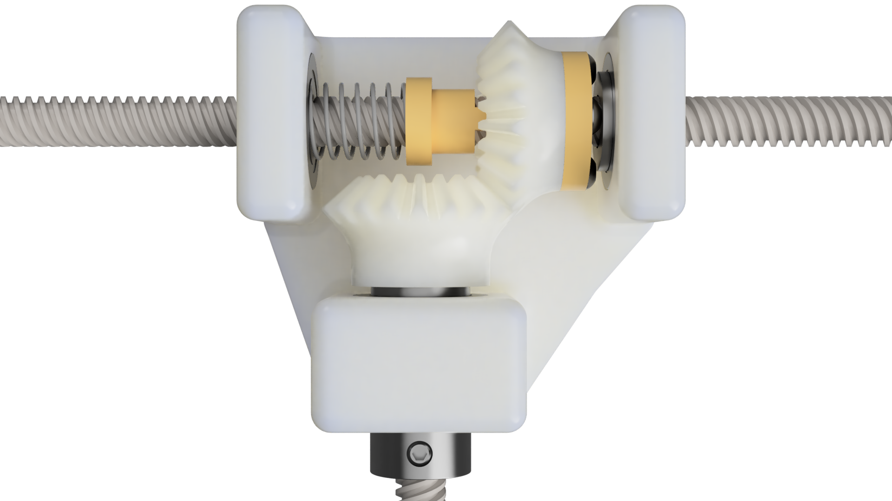

# ParaBot

## Background

ParaBot is an evolution of the H-Bot/CoreXY style of parallel, differential, Cartesian XY gantry. It is most similar to the H-Bot system, but attempts to solve several problems, both specific to H-Bots as well as 3D printers of this kind in general.

We'll cover the design details first, comparing to the two major current designs, and then discuss the new capabilities it provides.

## Overview

ParaBot uses a gantry layout where parallel linear guides are placed on top of the frame, comprising one axis, and another linear guide perpindicular to the first two, riding on their carriages. This layout is shared by H-Bot and CoreXY; H-Bot was named because the gantry resembles the letter `H`.

> For easy reference, we will consider the parallel guides the `Y` axis, and the moving guide the `X` axis.

The major difference is that ParaBot uses leadscrews to drive both `Y` and `X`, through a differential system. Kinematically, it's identical to H-Bot, and firmware which supports it will also work here.

The unique aspect of this design is how the `Y` guide leadscrews are attached to the `Y` carriages, and how they transmit differential motion to the `X` carriage.

A kinematic diagram is provided: 

## Design Details

As seen in the diagram, we use two motors to drive the `Y` lead screws (which use the same handedness thread), into a gearbox assembly attached to each `Y` carriage. In this gearbox are two bevel gears:

- The `Y` gear is attached to a screw nut which is able to rotate freely with the screw, as well as travel down the screw.
- The `X` gear is attached to the `X` lead screw, and rotates with it, in place.

When driving the `Y` screws in the same direction, they will attempt to drive the `X` gears in opposite directions, causing them to cog and lock. This will allow the `Y` nuts to push the gearboxes along the `Y` guides.

When driving the `Y` screws in opposite directions from each other, they will attempt to move each `Y` nut in opposite directions along `Y`, causing them to cog and lock. But they are still free to rotate in place, driving the `X` gears in the same direction, which will push the `X` carriage along the `X` guide.

A detailed view of a proposed gearbox design is provided: 

> Care was taken to ensure that both the nuts and gears are preloaded against backlash, as well as providing low-friction mating surfaces and bosses, for pieces that have to rotate against each other. Clamping and insertion points are provided for pieces that have to rotate together.

## Comparison to H-Bot

    TODO

## Comparison to CoreXY

    TODO

## Unique Features

    TODO
