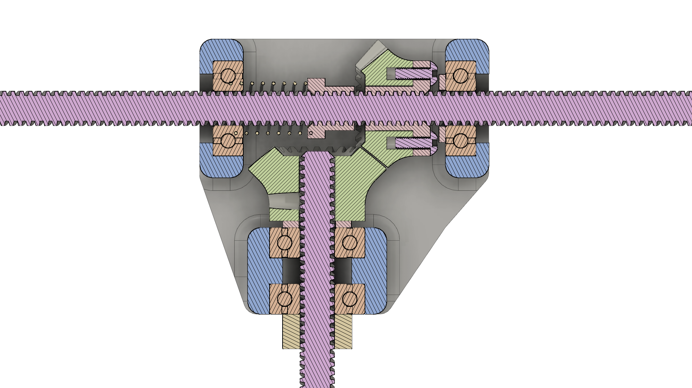

# DiffBot

## Background

`DiffBot` is an evolution of the `H-Bot/CoreXY` style of parallel, differential, Cartesian XY gantry. It is most similar to the `H-Bot` system, but attempts to solve several problems, both specific to `H-Bots` as well as 3D printers of this kind in general.

We'll cover the design details first, comparing to the two major current designs, and then discuss the new capabilities it provides.

## Overview

`DiffBot` uses a gantry layout where parallel linear guides are placed on top of the frame, comprising one axis, and another linear guide perpendicular to the first two, riding on their carriages. This layout is shared by `H-Bot` and `CoreXY`; `H-Bot` was named because the gantry resembles the letter `H`.

> For easy reference, we will consider the parallel guides the `Y` axis, and the moving guide the `X` axis.

The major difference is that `DiffBot` uses leadscrews to drive both `Y` and `X`, through a differential system. Kinematically, it's identical to `H-Bot`, and firmware which supports it will also work here.

The unique aspect of this design is how the `Y` guide leadscrews are attached to the `Y` carriages, and how they transmit differential motion to the `X` carriage.

## Design Details

As seen in the diagram, we use two motors to drive the `Y` lead screws (which use the same handedness thread), into a gearbox assembly attached to each `Y` carriage. In this gearbox are two bevel gears:

- The `Y` gear is attached to a screw nut which is able to rotate freely with the screw, as well as travel down the screw.
- The `X` gear is attached to the `X` lead screw, and rotates with it, in place.

When driving the `Y` screws in the same direction, they will attempt to drive the `X` gears in opposite directions, causing both gears to cog and lock. This will allow the `Y` nuts to push the gearboxes along the `Y` guides.

When driving the `Y` screws in opposite directions, they will attempt to move each `Y` nut in opposite directions along `Y`, causing `Y` motion to lock. But they are still free to rotate in place, driving the `X` gears in the same direction, which will push the `X` carriage along the `X` guide.

An illustration of the gearing motions can be seen here: 

A detailed view of a proposed gearbox design is provided: 

> Care was taken to ensure that both the nuts and gears are preloaded against backlash, as well as providing low-friction mating surfaces and bosses, for pieces that have to rotate against each other. Clamping and insertion points are provided for pieces that have to rotate together. The following section discusses backlash in detail.

Lastly, the lead screws' `lead` specification dictates how far a driven nut will travel per revolution. It does not apply when the nut is spinning with the screw, but in this design, when the `Y` nuts spin in place, the equal-sized gears transmit the rotation to the `X` screw, which drives the `X` carriage via its own nut. Therefore both axes are driven at the same mm/revolution rate that the screw `lead` dictates.

> See the `H-Bot` comparison for details about why a higher screw lead is preferable for dealing with the cogging forces of differential drives.

## Backlash

A major consideration when using screws, nuts, or gears is backlash. Backlash is when mating surfaces that transfer motion in one direction have some 'play' when the direction is reversed, before the mating surfaces engage again the other way. This leads to a loss of synchronization between the input and output, and accuracy suffers.

The proposed gearbox makes use of two screw nuts preloaded with a spring. The two nuts are pushed apart, but have a slot to keep them aligned together, forming an anti-backlash nut pair. Normally the pair is pushed apart with a spring between them, but they can be pushed in from the outside as well, as seen in this example. Therefore, either direction the screw spins, the backlash is taken up.

Similarly, the bevel gear teeth can be meshed fully, or separated to some degree. Spacing is chosen for the `Y` gear assembly to keep it fully meshed. If needed, another spring could be added between the gear and gearbox. If they are fully meshed and fit precisely, backlash is taken up.

With any preloading/anti-backlash system, wear is a concern. With proper lubrication on the nuts and gears, and with the proper spring strength, wear should be minimal since the gantry load is relatively small compared to the strength of the materials.

## Comparison to H-Bot

The traditional `H-Bot` gantry uses the same layout and two motors, and operates with the same differential kinematics. The motors are connected via a long continuous belt path around pulleys to change the direction, ultimately connecting to either side of the `X` carriage.

When the `X` carriage is moved, the sharp right angles on the pulleys of the `Y` carriages cause a twisting force (torque) on the `X` guide, which can cause it to go out of alignment if the guides/carriages aren't stiff or long enough to absorb the forces.

A diagram of the issue is provided (from [Gianluca Pugliese/FabAcademy](http://fabacademy.org/archives/2015/eu/students/pugliese.gianluca/project02.html)): 

`DiffBot` attempts to solve this problem because of the unique method of differentially driving lead screw nuts. It takes less torque for turning the nut along with the screw (in place) than driving the nut down the screw (locking the rotation). This difference becomes greater the longer the screw `lead` is.

In addition, the magnitude of differential forces depends on the distance from the `X` guide the force is being applied, since any distance will act as a lever. The example gearbox design attaches the `X` guide co-linearly with the `X` screw, which is very close to the `Y` nuts that will apply the differential forces to the gearbox. This should further reduce the cogging torque across the `X` guide's length since the angle between the opposite `Y` nuts is relatively small.

Given this setup, the twisting torque on the `X` guide should be far less than with belts. This makes it easier and cheaper to use guides that can deal with this torque without losing alignment.

## Comparison to CoreXY

`CoreXY` is an evolution of the basic `H-Bot`, as a method of solving the torque issue. It has equal and opposite attachment points to the `X` carriage by using two long belts and pulleys instead of just one. It is essentially two `H-Bot` systems on top of each other, to balance the forces.

> `DiffBot` may be able to balance the forces entirely with a more complex gearbox, but the differential forces are minor relative to the screw `lead` torque difference, so it's probably not necessary.

## Unique Features

- No belts
    - Both of the other systems require very long runs of belts with lots of pulleys that must be carefully positioned around the gantry and frame. They must also be tensioned correctly, and equally in the case of `CoreXY`, or the behavior suffers.
- Using leadscrews means materials can be chosen that can withstand much higher temperatures. This allows for enclosing the entire gantry (except the motors) in a heated chamber, making printing of high-temperature plastics vastly easier.
    - The Stratasys patents specify that all of the gantry is outside of the heated chamber, with only the hotend/dispenser in the chamber, by using a large flexible accordion it pushes through a narrow movable gap. `DiffBot` is able to keep the entire gantry inside.
- Almost entirely common parts and materials. Even the gears could be printed, though there are cheap sources of the required gear size and shape, and the example gearbox allows for clamping gears to nuts and screws without requiring custom gear shapes.
- Accomodates different screw leads and sizes with easy adjustments.
- The gear and nut preloading system allows the system to absorb shocks and sudden accelerations. If the spring compresses, the way the miter bevel teeth are shaped means as the spring expands again, the gears will re-align as they mesh again fully. This will rotate the nut back into its correct rotation on the screw. Essentially it provides a small form of closed loop reaction due to the mesh of gear teeth and screw threads.